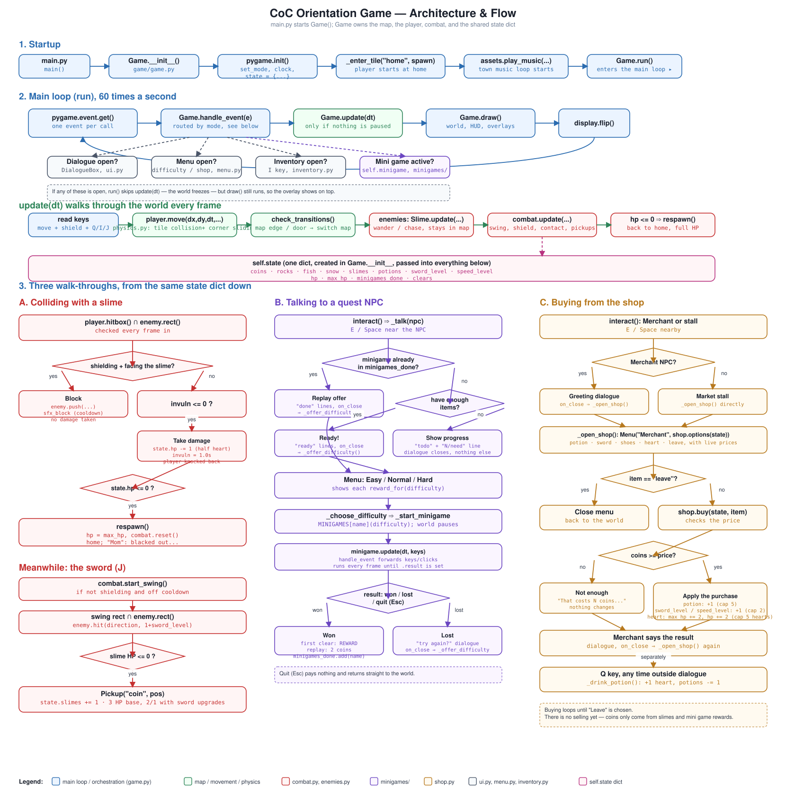

# Architecture and game flow

This describes how the code is put together and walks through the game flow from startup to
three concrete events: colliding with an enemy, playing a mini game, and buying from the shop.
For what the game does from a player's point of view, see the main [README](../README.md).

The diagram above (`docs/architecture.svg`) is the same walk-through as this document, drawn out.
Open it directly if the embedded version is hard to read.

## The shape of it

One object, `Game` (`game/game.py`), owns everything: the current `Map`, the `Player`, the
`Combat` system, and a single plain dictionary, `self.state`. That dictionary is the save data —
coins, rocks, fish, snow, slimes defeated, potions, sword and shoe upgrade levels, HP, and quest
and replay tracking. Nothing else holds its own copy of progress. Combat, the shop, the mini
games, and the inventory overlay all read and write the same dict, which is why giving a mini
game a reward is just `state["coins"] += reward` from `Game`, not a method call into some other
system.

| Layer | Modules | Responsibility |
|---|---|---|
| Orchestration | `game.py` | The main loop, map transitions, quest and shop logic, routing input to whichever system is active |
| World | `world.py`, `maps.py`, `physics.py`, `player.py`, `npc.py` | The tile grid, collision, the six maps as data, player movement |
| Combat | `combat.py`, `enemies.py`, `items.py` | Sword swings, the shield, slimes, pickups |
| Mini games | `minigames/` | Four self-contained games, each a subclass of `MiniGame` |
| Shop | `shop.py` | Prices and what each purchase does to `state` |
| Presentation | `ui.py`, `menu.py`, `inventory.py`, `effects.py` | Dialogue box, list menus, the inventory overlay, floating "+1" text |
| Assets | `assets.py` | Image, sound, and sprite-sheet loading, with placeholders when a file is missing |

## 1. Startup

`main.py` calls `Game()`. The constructor calls `pygame.init()`, opens the window, builds
`self.state` with everything at its starting value, and calls `_enter_tile("home", spawn)` to
place the player. It starts the town music loop, then `main()` calls `Game.run()`.

## 2. The main loop

`run()` is a plain `while self.running` loop, 60 times a second:

1. `pygame.event.get()` → each event goes to `handle_event(event)`.
2. If nothing is paused, `update(dt)` runs.
3. `draw()` always runs, so a paused overlay still renders on top of the frozen world.

Four things can pause `update(dt)`: an open `DialogueBox`, an open `Menu` (used for both the
difficulty picker and the shop), the inventory overlay, or an active mini game. `handle_event`
checks these in order and routes the event to whichever one is open; otherwise the event is
treated as a normal world input (move, J to swing, Q to drink a potion, I for the inventory, E to
interact).

Inside `update(dt)` for the ordinary world case: read the held keys, move the player
(`player.move`, which does the tile collision and corner-sliding in `physics.py`),
`check_transitions()` to see if the player crossed a map edge or stepped onto a door tile, update
each living enemy, then `combat.update(...)` for swings, the shield, contact damage, and pickups.
If HP has hit zero, `respawn()` runs.

## 3. Three walk-throughs

### A. Colliding with a slime

Every frame, `combat.update` checks whether the player's hitbox overlaps a `Slime`'s rect.

- **Shielding and facing it:** the hit is blocked. The slime is pushed back, a block sound plays
  (on a short cooldown so it doesn't spam), and the player takes no damage.
- **Not blocked, and not currently invulnerable:** `state["hp"]` drops by 1 (half a heart — a
  slime deals half a heart), a second of invulnerability starts, and the player is knocked back.
- **HP reaches zero:** `respawn()` sends the player back to `home` at full HP, and Mom has a line
  about it.

Separately, pressing **J** calls `combat.start_swing()`. While the swing is active, its hitbox is
checked against every living enemy once. A hit calls `enemy.hit(direction, damage)`, where damage
is `1 + state["sword_level"]`. Slimes have 3 HP, so the base sword takes three hits, one sword
upgrade takes two, and two upgrades take one. A kill drops a coin pickup and increments
`state["slimes"]`, which is what the east quest counts.

### B. Talking to a quest NPC

`interact()` finds the nearest NPC in range and calls `_talk(npc)`.

- If the NPC has no `task`, it's a plain conversation.
- If the quest's mini game is already in `state["minigames_done"]`, the NPC's "done" lines play,
  and closing that dialogue opens the difficulty menu again — this is how replays start.
- If the player doesn't have enough of the quest item yet, the "todo" lines show with a live
  `have/need` count, and nothing else happens.
- Otherwise the "ready" lines play, and closing them opens the difficulty menu.

The difficulty menu (`Menu`, same class the shop uses) lists Easy, Normal, and Hard with each
difficulty's reward. Choosing one calls `_start_minigame(name, npc_name, difficulty)`, which
constructs the mini game class with that difficulty — the constructor copies that difficulty's
`PRESETS` dict over the class's normal constants, so the rest of the mini game's code never has
to know which difficulty it's running.

While a mini game is active, `Game.update` and `Game.handle_event` both hand off to it directly
(`minigame.update(dt, keys)`, `minigame.handle_event(event)`) instead of running the world. Each
mini game sets `self.result` to `"won"`, `"lost"`, or `"quit"` when it's done, and that is what
`finished` checks. Back in `Game`, `_end_minigame()` reacts:

- **Won:** the first win at that difficulty pays the mini game's full reward; a repeat pays a
  flat 2 coins (`REPLAY_REWARD`), so replays stay available without becoming a coin farm.
  `state["minigames_done"]` gets the mini game's name either way.
- **Lost:** a "want to try again?" dialogue opens the difficulty menu again.
- **Quit (Esc):** nothing happens — no reward, straight back to the world.

### C. Buying from the shop

The shop opens the same way from two places: talking to the Merchant (after his greeting line
closes) or interacting with any market stall tile directly, both calling `_open_shop()`.

`_open_shop()` builds a `Menu` from `shop.options(state)`, which lists the health potion, the
sword and shoe upgrades, and the extra heart, each labelled with its current price or "sold out"
once it has reached its cap. Choosing an entry calls `_shop_choose(item)`:

- `"leave"` just closes the menu.
- Anything else calls `shop.buy(state, item)`, which checks the price against `state["coins"]`.
  Not enough coins: a message says so and nothing changes. Enough coins: the price is deducted
  and the effect applies directly to `state` — `potions += 1` (capped at 5), `sword_level` or
  `speed_level += 1` (capped at 2), or `max_hp += 2` and `hp += 2` for an extra heart (capped at
  5 hearts, 10 half-heart units).

The merchant's response is shown as a dialogue, and closing it reopens the shop, so buying loops
until the player chooses "Leave". Potions aren't drunk here — they're stockpiled and used later
with **Q** (`_drink_potion()`), which heals one heart if the player isn't already full and has at
least one potion.

There is no selling yet. Coins only come in from slimes and mini game rewards; `shop.buy` is a
one-way purchase.

## Design notes

- **Collision and bounds.** `physics.move_body` moves one axis at a time and, if blocked, tries
  sliding a few pixels sideways to find a gap — that's what stops the player getting stuck on a
  wall a few pixels off-centre. Everything outside a map's tile grid is solid except the two-tile
  exit gaps (`Map._gap_outside`), and enemies collide with `through_exits=False` so they can
  never wander out through those gaps the way the player does.
- **The shared state dict.** A single dict instead of a progress class keeps every system —
  combat, quests, the shop, the inventory — reading and writing the same place by key name, so
  adding a new counter (like `state["snow"]`) doesn't require touching a class definition.
- **Difficulty as data.** `MiniGame.PRESETS` is a dict of dicts; the base constructor just
  `setattr`s each override onto the instance. A mini game's own logic always reads `self.X`, so
  it never branches on which difficulty it's running.
- **Menus drive both the shop and difficulty choice.** `Menu` is a single, small, reusable list
  widget with an `on_choose` callback, used for two otherwise unrelated screens.

## Adding to this

- **A new mini game:** subclass `MiniGame` in `game/minigames/`, add it to `MINIGAMES` in
  `game/minigames/__init__.py`, and give some NPC in `maps.py` a `"task"` with that `"minigame"`
  name.
- **A new region or quest:** add a map to `MAPS` in `maps.py` with its `grid`, `links` (which
  sides exit where), optional `doors`, `npcs`, `enemies`, and `pickups`. `quest_rows()` in
  `game.py` reads quest data straight from the NPC entries, so a new quest shows up in the
  inventory automatically.
- **A new shop item:** add it to `shop.PRICES` and `shop.options()`, and apply its effect in
  `shop.buy()`.
